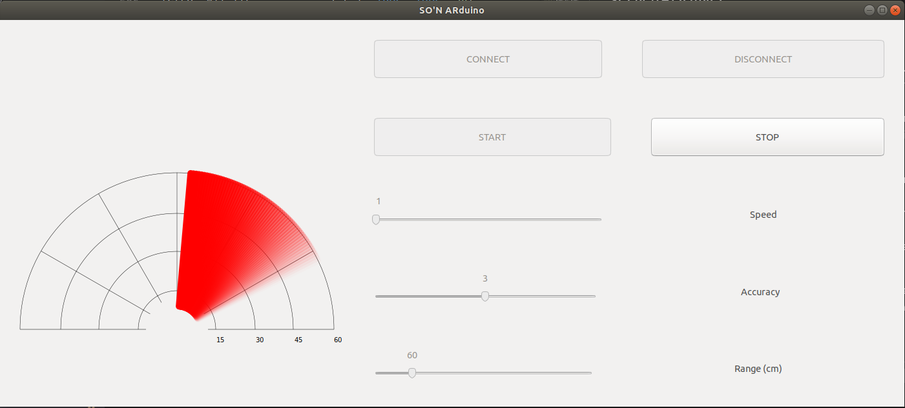

# Progetto Sistemi Operativi
## SO' N ARduino


### Introduzione

Il progetto SO' N ARduino riguarda l'acquisizione di dati da un sensore ad ultrasuoni, il quale ruotando su se stesso con l'ausilio di un servomotore riesce a scansionare lo spazio intorno a se per un angolo di 180°.
I dati raccolti vengono trasmessi dall'arduino al pc mediante una connessione seriale. Dal pc è possibile visualizzare graficamente i dati ricevuti dal sonar ed impartire comandi al sonar tramite un'interfaccia grafica GTK, configurando i 3 paramentri principali:<br/> 
<ul>
<li>velocità: valore da 1 a 10 - indica l'angolo di avanzamento che deve descrivere il servomotore ad ogni step;</li>
<li>accuratezza: valore tra 1 e 5 - accuratezza n significa che il risultato illustrato sarà la media tra n misurazioni consecutive;</li>
<li>range di visualizzazione: da 20cm a 2,56m - può aver senso limitare l'utilizzo del sonar ed interessarsi a visualizzare ostacoli solo entro uno certo range.</li>
</ul>
Una volta avviata una scansione, le configurazioni scelte di velocità e accuratezza verranno salvate in automatico sulla EEPROM dell'Arduino in modo da averle al prossimo avvio (il range viene gestito lato client).

### Materiali
<ul>
<li>1x Arduino Mega rev v3</li>
<li>1x Sensore ultrasuoni hc-sr04</li>
<li>1x Servomotore sg90</li>
</ul>

## Arduino

### Servomotore

Il servomotore sg90 è un piccolo servo analogico che copre un angolo di 120 gradi (ma si può settare per usarlo a 180). Per comandarlo si usa una modulazione in PWM, nello specifico Fast PWM non invertita. A tal fine si utilizza un Timer (nel nostro caso il Timer/Counter1) con TOP = ICR. TOP viene calcolato con la seguente formula:<br/>
>f_pwm = f_cpu/(prescale(1+top)) => top = (f_cpu / (f_pwm * prescale)) - 1

Per indicare l'angolo si setta l'output compare register del timer con il valore desiderato. Quest'ultimo viene calcolato in modo tale che sia compreso tra il duty cicle minimo per posizionare il servo nell'angolo 0 e quello per posizionare il servo nell'angolo 180. Tali informazioni sono reperibili sul datasheet del servomotore.

### Sonar HC-SR04

Il  sensore a ultrasuoni HC-SR04 può essere attivato mediante un segnale digitale sul pin TRIG della durata di 10 us. Una volta ricevuto il segnale emette gli ultrasuoni e porta il pin ECHO a +5V per una durata uguale al tempo di andata+ritorno del suono. La distanza rilevata si calcola quindi come:<br/>
>distanza = (tempo_pin_echo / 2) * velocita_suono

Per calcolare il tempo per il quale il pin ECHO è a +5V si utilizza un timer a 16 bit sfruttando gli interrupt di overflow del timer. In questo modo si può calcolare il tempo come:<br/>
>tempo_pin_echo = num_overflow * 65535 + TCNTn

### EEPROM

Salviamo i valori dei setting di velocità e accuratezza nei primi due byte della EEPROM in modo tale da renderli permanenti nella memoria. 

## Seriale

La comunicazione è seriale e a pacchetti.
I pacchetti sono struct di tipo Packet, la quale può essere estesa per far fronte all'esigenza di pacchetti con funzionalità specifiche ( CommandPacket, StatusPacket, ErrorPacket, EventPacket, ConfigurationPacket ).<br/>
Tutta la comunicazione seriale gira attorno a 4 funzioni: 2 per inviare e 2 per ricevere.
<ul>
<li>arduino_send_packet()</li>
<li>arduino_receive_packet()</li>
<li>client_send_packet()</li>
<li>client_receive_packet()</li>
</ul> 

### Arduino Side

Si utilizza la seriale per scambiare pacchetti tra l'arduino e il pc. Usiamo un approccio basato sulle interruzioni dato che i pacchetti vengono scambiati in modo bidirezionale e asincrono. <br/>
In ricezione i pacchetti sono sempre di tipo CommandPacket e l'informazione è organizzata nel seguente modo:
<table border="2">
<tr>
    <th>0xaa</th>
    <th>0x55</th>
    <th>PACKET TYPE</th>
    <th>COMMAND</th>
    <th>PAYLOAD</th>
    <th>CS</th>
<tr>
<tr>
    <th colspan=2>HEADER</th>
    <th colspan=3>COMMAND PACKET</th>
    <th>CHECKSUM</th>
</tr>
</table>


Il checksum viene calcolato come somma dei byte precedenti a partire dal primo byte dell'header.

L'accettazione dei pacchetti avviene con un automa a stati finiti che controlla che il pacchetto ricevuto sia valido.


### Client Side

Lato client viene aperta la seriale e settata con tutti i parametri necessari (baudrate, lettura/scrittura, ecc..).
Il file descriptor così aperto viene passato come parametro alle funzioni client_send_packet() e client_receive_packet().

Tutte le letture vengono gestite attraverso un thread che ha solo il compito di aspettare un nuovo pacchetto, riconoscerne il tipo di appartenenza e comportarsi in modo adeguato.

I pacchetti in ingresso possono essere di tipi e lunghezze diverse perciò in questa direzione si necessita di un byte in più per specificare la lunghezza del pacchetto.
<table border="2">
<tr>
    <th>0xaa</th>
    <th>0x55</th>
    <th>0xn</th>
    <th>PACKET TYPE</th>
    <th>[OTHER PACKET VALUES]</th>
    <th>CS</th>
<tr>
<tr>
    <th colspan=2>HEADER</th>
    <th>LENGTH</th>
    <th colspan=2>PACKET</th>
    <th>CHECKSUM</th>
</tr>
</table>

## Client GUI

Per la realizzazione dell'interfaccia grafica abbiamo utilizzato la libreria gtk3.<br>
Nella parte sinistra dell'interfaccia è presente una gtk_drawing_area che viene disegnata grazie ad un'altra libreria: Cairo.

Ogni 100 millisecondi scade un timeout che refresha la drawing area e permette di vedere le misurazioni in tempo reale.

Le misurazioni sono salvate all'interno di una linked list di lunghezza massima costante gestita in modo FIFO, in modo da poter dimenticare in automatico le misurazioni più vecchie e mantenere le più recenti.<br/>
La linked list viene passata come parametro alla funzione che si occupa di graficare le misurazioni, la quale disegnerà un segmento più o meno lungo per ogni misurazione nella lista.

Alla pressione del tasto Connect, oltre all'apertura del collegamento seriale, vengono richieste e scaricate le configurazioni salvate sulla EEPROM dell'Arduino e gli slider si posizionano sui valori giusti.

Alla pressione di Start e Stop vengono inviati all'Arduino i rispettivi comandi.<br>
Inoltre se gli slider sono stati cambiati ed indicano valori diversi da quelli salvati sull'Arduino, alla pressione di Start vengono salvati gli attuali valori di speed e accuracy.

Alla pressione di Disconnect viene fatto join sul thread reader occupato a leggere dalla seriale, e viene chiuso il file descriptor associato alla seriale.



# How-to-Run

#### Collegamenti PIN
<ul>
<li>Sonar TRIG - PIN SCL 21</li>
<li>Sonar ECHO - PIN 2</li>
<li>Servo PWM - PIN 12</li>
</ul>

#### Compilazione 
Per compilare il programma:

##### Arduino

```bash
$ cd src/arduino
../src/arduino$ make main.hex
```

##### Client

```bash
$ cd src/client
../src/client$ gcc main.c gui/linked_list.c client_packet/client_packet.c ../packet/packet.c -o main `pkg-config --cflags --libs cairo gtk+-3.0` -lm
```

#### Esecuzione
Per eseguire:
```bash
$ .../src/client$ ./main
```